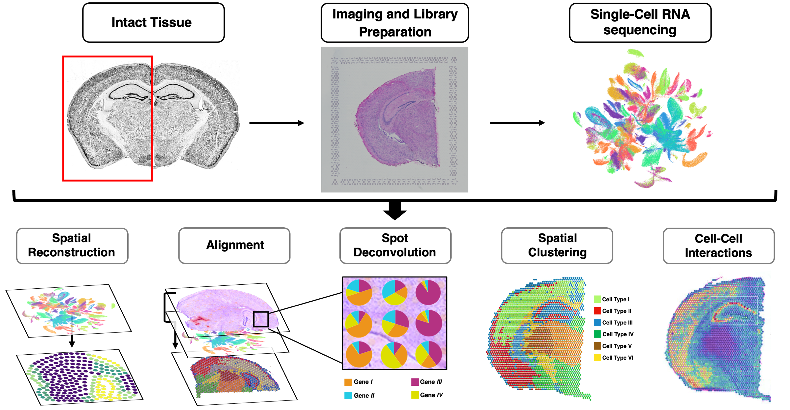

# Deep Learning in Spatial Transcriptomics Analysis

Our goal is to help the scientific community by providing a (continously updated) list of various deep learning models used in the various stages of spatial transcriptomics analysis. 

***We would really appreciate your contributions, so please do not hesitate to do a PR with data on a new paper and/or tool.***

# Review Papers
Our review paper on deep learning in spatial transcriptomics can be found [here](https://www.biorxiv.org/content/10.1101/2022.02.28.482392v1). We also have a review paper on the applications of deep learning in single-cell omics analysis, which can be accessed from [this link](https://www.biorxiv.org/content/10.1101/2021.11.26.470166v2).

# Methods

To provide a distinction between Deep Learning and Machine Learning/Statistical methods, we divide computational approaches for ST analysis into two sections:
## Deep Learning Approaches
| Stage/Category                             | Model (with GitHub Link)                                                | Title of Paper                                                                                                | Language            | Year | Reference                                                                                                                                                                                                                                             | Additional Notes |
|------------------------------------|-------------------------------------------------------------------------|---------------------------------------------------------------------------------------------------------------|---------------------|------|-------------------------------------------------------------------------------------------------------------------------------------------------------------------------------------------------------------------------------------------------------|------------------|
| ***1. Spatial Reconstruction***           | [DEEPsc](https://github.com/fmaseda/DEEPsc)                             | DEEPsc: A Deep Learning-Based Map Connecting Single-Cell Transcriptomics and Spatial Imaging Data             | MATLAB              | 2021 | Maseda F, Cang Z, Nie Q. 2021. DEEPsc: A Deep Learning-Based Map  Connecting Single-Cell Transcriptomics and Spatial Imaging Data. Front  Genet 12: 636743.                                                                                           |                  |
| ***1. Spatial Reconstruction***           | [HematoFatePrediction](https://github.com/marrlab/HematoFatePrediction) | Prospective identification of hematopoietic lineage choice by deep learning                                   | MATLAB              | 2017 | Buggenthin F, Buettner F, Hoppe PS, Endele M, Kroiss M, Strasser M,  Schwarzfischer M, Loeffler D, Kokkaliaris KD, Hilsenbeck O, et al. 2017.  Prospective identification of hematopoietic lineage choice by deep  learning. Nat Methods 14: 403–406. |                  |
|                                    |                                                                         |                                                                                                               |                     |      |                                                                                                                                                                                                                                                       |                  |
| ***2. Spot Deconvolution***               | [DestVI](https://github.com/romain-lopez/DestVI-reproducibility)                       | DestVI identifies continuums of cell types in spatial transcriptomics data | Python (PyTorch) | 2022 | Lopez, R., Li, B., Keren-Shaul, H. et al. DestVI identifies continuums of cell types in spatial transcriptomics data. Nat Biotechnol (2022). https://doi.org/10.1038/s41587-022-01272-8                                               |                  |
| ***2. Spot Deconvolution***               | [DSTG](https://github.com/Su-informatics-lab/DSTG)                       | DSTG: deconvoluting spatial transcriptomics data through graph-based artificial in- telligence | Python/R | 2021 | Q. Song and J. Su, “DSTG: deconvoluting spatial transcriptomics data through graph-based artificial in- telligence,” Briefings in Bioinformatics 22 (2021), https://doi.org/10.1038/s41587-022-01272-8.                                         |                  |
|                                    |                                                                                      
| ***3. Data Integration (scRNAseq + ST)*** | [Tangram](https://github.com/broadinstitute/Tangram)                    | Deep Learning and Alignment of Spatially Resolved Single-Cell Transcriptomes with Tangram                     | Python (PyTorch)    | 2021 | Biancalani, T., Scalia, G., Buffoni, L. et al. Deep learning and alignment of spatially resolved single-cell transcriptomes with Tangram.Nat Methods 18, 1352–1362 (2021). https://doi.org/10.1038/s41592-021-01264-7.                                |                  |
| ***3. Data Integration (scRNAseq + ST)*** | [ST-Net](https://github.com/bryanhe/ST-Net)                             | Integrating Spatial Gene Expression and Breast Tumour Morphology via Deep Learning                            | Python (PyTorch)    | 2021 | He B, Bergenstråhle L, Stenbeck L, Abid A, Andersson A, Borg Å, Maaskola  J, Lundeberg J, Zou J. 2020. Integrating spatial gene expression and  breast tumour morphology via deep learning. Nat Biomed Eng 4: 827–834.                                |                  |
|                                    | 
| ***4. Spatial Clustering***               | [spaCell](https://github.com/BiomedicalMachineLearning/SpaCell)                       | SpaCell: integrating tissue morphology and spatial gene expression to predict disease cells | Python | 2019 | X. Tan, A. Su, M. Tran, and Q. Nguyen, “SpaCell: integrating tissue morphology and spatial gene expression to predict disease cells,” Bioinformatics 36, 2293– 2294 (2020). |                  |
| ***4. Spatial Clustering***               | [stLearn](https://github.com/BiomedicalMachineLearning/stLearn)                       | stLearn: integrating spatial location, tissue morphology and gene expression to find cell types, cell-cell interactions and spatial trajectories within undissociated tissues | Python | 2020 | D. Pham, X. Tan, J. Xu, L. F. Grice, P. Y. Lam, A. Raghubar, J. Vukovic, M. J. Ruitenberg, and Q. Nguyen, “stlearn: integrating spatial location, tissue morphology and gene expression to find cell types, cell-cell interactions and spatial trajectories within undissociated tissues,” bioRxiv (2020). |                  |
| ***4. Spatial Clustering***               | [spaGCN](https://github.com/jianhuupenn/SpaGCN)                       | spaGCN: Integrating gene expression, spatial location and histology to identify spatial domains and spatially variable genes by graph convolutional network | Python | 2021 | J. Hu, X. Li, K. Coleman, A. Schroeder, N. Ma, D. J. Irwin, E. B. Lee, R. T. Shinohara, and M. Li, “spaGCN: Integrating gene expression, spatial location and histology to identify spatial domains and spatially variable genes by graph convolutional network,” Nature Methods 18, 1342–1351 (2021). |                  |
|   |
| ***5. Integrative Tookit***               | [GLUER](https://github.com/software-github/GLUER)                       | GLUER: integrative analysis of multi-omics and imaging data at single-cell resolution by deep neural networks | Python (TensorFlow) | 2021 | GLUER: integrative analysis of single-cell omics and imaging data by deep neural network. Tao Peng, Gregory M. Chen, KaiTan. bioRxiv 2021.01.25.427845; doi: https://doi.org/10.1101/2021.01.25.427845                                                |                  |
# Machine Learning/Statistical Approaches

| Stage/Category                             | Model (with GitHub Link)                                                | Title of Paper                                                                                                | Language            | Year | Reference                                                                                                                                                                                                                                             | Additional Notes |
|------------------------------------|-------------------------------------------------------------------------|---------------------------------------------------------------------------------------------------------------|---------------------|------|-------------------------------------------------------------------------------------------------------------------------------------------------------------------------------------------------------------------------------------------------------|------------------|
| ***1. Spatial Reconstruction***           | [Seurat](https://github.com/satijalab/seurat)                             | Spatial reconstruction of single-cell gene expression data            | R              | 2015 | R. Satija, J. A. Farrell, D. Gennert, A. F. Schier, and A. Regev, “Spatial reconstruction of single-cell gene expression data,” Nature Biotechnology 33, 495–502 (2015)                                                                                           |                  |
| ***1. Spatial Reconstruction***           | [novoSpaRc](https://github.com/rajewsky-lab/novosparc)                             | Gene expression cartography             | Python             | 2019 | M. Nitzan, N. Karaiskos, N. Friedman, and N. Rajewsky, “Gene expres- sion cartography,” Nature 576, 132–137 (2019).                                                                                           |                  |
|                                    |                                                                         |                                                                                                               |                     |      |                                                                                                                                                                                                                                                       |                  |
| ***2. Spot Deconvolution***               | [Steroscope](https://github.com/almaan/stereoscope)                       | Single-cell and spatial transcriptomics enables probabilistic inference of cell type topography | Python | 2020 | A. Andersson, J. Bergenstråhle, M. Asp, L. Bergenstråhle, A. Jurek, J. Fernández Navarro, and J. Lundeberg, “Single-cell and spatial transcriptomics enables probabilistic inference of cell type topography,” Communications Biology 3, 565 (2020).                                           |                  |
| ***2. Spot Deconvolution***               | [SPOTlight](https://github.com/MarcElosua/SPOTlight)                       | Single-cell and spatial transcriptomics enables probabilistic inference of cell type topography | Python | 2020 | M. Elosua-Bayes, P. Nieto, E. Mereu, I. Gut, and H. Heyn, “SPOTlight: seeded NMF regression to deconvolute spatial tran- scriptomics spots with single-cell transcriptomes,” Nucleic Acids Research 49, e50–e50 (2021).                                            |                  |
| ***2. Spot Deconvolution***               | [RTCD](https://github.com/dmcable/RCTD)   | Robust decomposition of cell type mixtures in spatial tran- scriptomics | R | 2021 | D. M. Cable, E. Murray, L. S. Zou, A. Goeva, E. Z. Macosko, F. Chen, and R. A. Irizarry, “Robust decomposition of cell type mixtures in spatial transcriptomics,” Nature Biotechnology (2021), 10.1038/s41587-021-00830- w.                                           |                  |
| ***2. Spot Deconvolution***               | [SpatialDWLS](https://github.com/RubD/Giotto)                       | SpatialDWLS: Accurate deconvolution of spatial transcriptomic data | Python (PyTorch) | 2021 | R. Dong and G.-C. Yuan, “Spatialdwls: accurate deconvolution of spatial transcriptomic data,” Genome Biology 22, 145 (2021).                                        |                  |
| ***2. Spot Deconvolution***               | [Cell2Location](https://github.com/BayraktarLab/cell2location)                       | Cell2Location maps fine-grained cell types in spatial transcriptomics | Python | 2022 | V. Kleshchevnikov, A. Shmatko, E. Dann, A. Aivazidis, H. W. King, T. Li, R. Elmentaite, A. Lomakin, V. Kedlian, A. Gayoso, M. S. Jain, J. S. Park, L. Ramona, E. Tuck, A. Arutyunyan, R. Vento-Tormo, M. Ger- stung, L. James, O. Stegle, and O. A. Bayraktar, “Cell2location maps fine-grained cell types in spatial transcriptomics,” Nature Biotechnology (2022), 10.1038/s41587-021-01139-4.                                             |                  |
| ***2. Spot Deconvolution***               | [CARD](https://github.com/YingMa0107/CARD)                       | Spatially informed cell-type deconvolution for spatial transcriptomic | R | 2022 | Y. Ma and X. Zhou, “Spatially informed cell-type deconvolution for spatial transcriptomics,” Nature Biotechnology 40, 1349–1359 (2022).  |                  |
|                                    |  
| ***3. Spatially Variable Genes ID***               | [Trendsceek](https://github.com/edsgard/trendsceek)                       | Identification of spatial expression trends in single-cell gene expression data | R | 2018 | D. Edsgärd, P. Johnsson, and R. Sandberg, “Identification of spatial expression trends in single-cell gene expression data,” Nature Methods 15, 339–342 (2018).  |                  |
| ***3. Spatially Variable Genes ID***               | [SpatialDE](https://github.com/Teichlab/SpatialDE)                       | SpatialDE: Identification of spatially variable genes | Python | 2018 | V. Svensson, S. A. Teichmann, and O. Stegle, “SpatialDE: Identification of spatially variable genes,” Nature Methods 15, 343–346 (2018). |                  |
| ***3. Spatially Variable Genes ID***               | [Spark](https://github.com/xzhoulab/SPARK)                       | Statistical analysis of spatial expression patterns for spatially resolved transcriptomic studies | R | 2020 | S. Sun, J. Zhu, and X. Zhou, “Statistical analysis of spatial expression patterns for spatially resolved transcriptomic studies,” Nature Methods 17, 193–200 (2020).  |                  |
 |                  |
| ***4. Spatial Clustering***               | [HMRF](https://bitbucket.org/qzhudfci/smfishhmrf-py/)                       | Identification of spatially associated subpopulations by combining scrnaseq and sequential fluorescence in situ hybridization data | R | 2018 | Q. Zhu, S. Shah, R. Dries, L. Cai, and G.-C. Yuan, “Identification of spatially associated subpopulations by combining scrnaseq and sequential fluorescence in situ hybridization data,” Nature Biotechnology 36, 1183– 1190 (2018). |                  |
| ***4. Spatial Clustering***               | [BayesSpace](https://github.com/edward130603/BayesSpace)                       | Identification of spatially associated subpopulations by combining scrnaseq and sequential fluorescence in situ hybridization data | R | 2021 | E. Zhao, M. R. Stone, X. Ren, J. Guenthoer, K. S. Smythe, T. Pulliam, S. R. Williams, C. R. Uytingco, S. E. B. Taylor, P. Nghiem, J. H. Bielas, and R. Gottardo, “Spatial transcriptomics at subspot resolution with bayess- pace,” Nature Biotechnology 39, 1375–1384 (2021). |                  |
|                                    | 
| ***5. Cell-Cell Interaction/Communication*** | [SpaOTsc](https://github.com/zcang/SpaOTsc)   | Inferring spatial and signaling relationships between cells from single cell transcriptomic data | Python  | 2020 |  Z. Cang and Q. Nie, “Inferring spatial and signaling relationships between cells from single cell transcriptomic data,” Nature Communications 11, 2084 (2020).
| ***5. Cell-Cell Interaction/Communication*** | [MISTy](https://github.com/saezlab/mistyR)   |  Explainable multi-view framework for dissecting intercellular signaling from highly multiplexed spatial data | R  | 2020 | J. Tanevski, R. O. R. Flores, A. Gabor, D. Schapiro, and J. Saez-Rodriguez, “Explainable multi-view framework for dissecting intercellular signaling from highly multiplexed spatial data,” bioRxiv (2021).  |                  |
| ***5. Cell-Cell Interaction/Communication*** | [Giotto](https://github.com/RubD/Giotto)   |  Giotto: a toolbox for integrative analysis and visualization of spatial ex- pression data | R  | 2021 | R. Dries, Q. Zhu, R. Dong, C.-H. L. Eng, H. Li, K. Liu, Y. Fu, T. Zhao, A. Sarkar, F. Bao, R. E. George, N. Pierson, L. Cai, and G.-C. Yuan, “Giotto: a toolbox for integrative analysis and visualization of spatial expression data,” Genome Biology 22, 78 (2021).  |                  |
